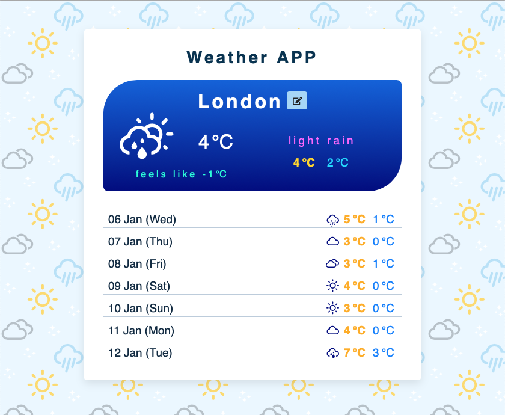

# JavaScript Project_Weather App

This is a weather app that shows today's and the future week's weather. London is the default city, you can change it to any city you like by clicking the edit button on the right. It will show your latest chosen city when you reopen the app next time.

Live site: https://jasontwuk.github.io/JavaScript-Project_Weather-App/

Here is how it looks like:

